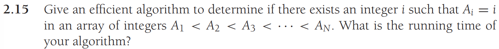

# Data Structures in Java - Homework 1

## Problem 1


__Answer:__ $2/N < 37 < \sqrt{N} < N < Nlog{log{N}} < Nlog{N} = Nlog(N^2) < Nlog^2{N} < N^{1.5} < N^{2} < N^2log{N} < N^{3} < 2^{N/2} < 2^N$


## Problem 2


*a)* __Answer:__ $\$2^{2^N}$

*b)* __Answer:__ $O(log{log{D}})$


## Problem 3
*a)* __Answer:__ $O(N)$

*b)* __Answer:__ $O(N)$

*c)* __Answer:__ $O(log{N})$

*d)* __Answer:__ $O(N^3)$


## Problem 4


*a)* __Answer:__ $O(N)$

*b)* __Answer:__ $O(N^2)$

*c)* __Answer:__ $O(N^2)$


## Problem 5



__Answer:__ Binary Search - $O(log{N})$:

```java
public static <E extends Comparable<E>>
int BinarySearch(E[] a, E value) {
    
    int start = 0;
    int stop = a.length - 1;

    while (start<=stop) {
        int mid = (start+stop)/2;

        int compareResult = a[mid].compareTo(value);
        if(compareResult == 0) {
            return mid;
        } else if (compareResult > 0) {
            stop = mid - 1;
        } else {
            start = mid + 1;
        }
    }

    return -1;
        
}
```