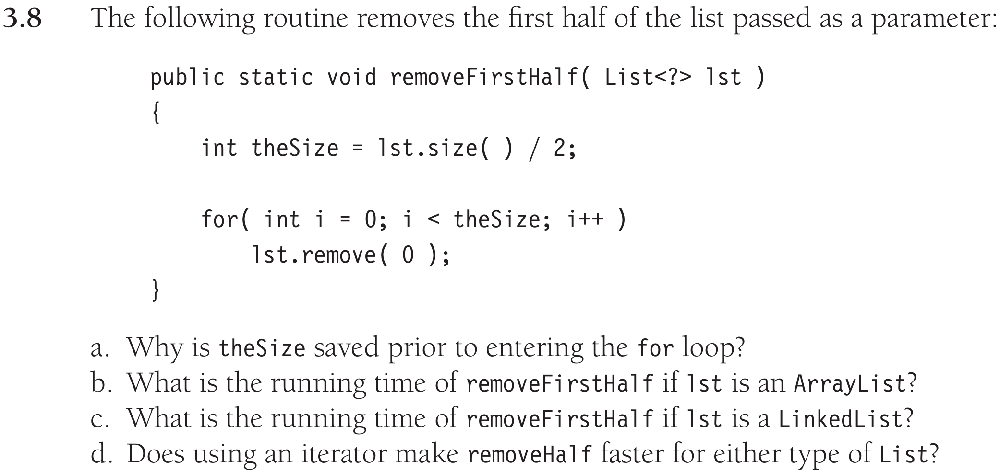

# Data Structures in Java - Homework 3

## Problem 1
__Answer:__
```Java
public static <T> void printLots(List<T> L, List<Integer> P) {

    int targetIdx;

    Iterator<Integer> pIter = P.iterator();
    while (pIter.hasNext()) {

        targetIdx = pIter.next();
        int index = -1;

        Iterator<T> lIter = L.iterator();
        while (lIter.hasNext()) {

            index++;
            T currT = lIter.next();
            if (index != targetIdx) { continue; }
            System.out.println(currT);
            
        }
    }
}
```

## Problem 2


*a)* __Answer:__ `theSize` was declared and initialized to an Integer with value `lst.size() / 2` before entering the `for` loop.

*b)* __Answer:__ $O(N^2)$

 Because `lst.size()` is $O(1)$, the `for` loop is $O(\text{theSize})$, and `lst.remove(0)` is $O(\text{theSize})$ since all elements shift to the front when removing the first. 

*c)* __Answer:__ $O(N)$

 Because `lst.size()` is $O(N)$, the `for` loop is $O(\text{theSize})$, and `lst.remove(0)` is $O(1)$ since there is no need to shift elements when removing the first.

*d)* __Answer:__ No


## Problem 3
__Answer:__
```Java
class TwoStacks<T> {
    private T [] myItems;
    private int mySize1;
    private int mySize2;
    private static final int DEFAULT_CAPACITY = 10;

    @SuppressWarnings("unchecked")
    public TwoStacks() {
        ensureCapacity(DEFAULT_CAPACITY);
        mySize1 = 0;
        mySize2 = 0;
    }

    @SuppressWarnings("unchecked")
    public void ensureCapacity( int newCapacity )
    {
        if( newCapacity < topIndex1()+1 && newCapacity < topIndex2()+1 ) {
            return;
        }

        T [] old = myItems;
        myItems = (T []) new Object[ newCapacity ];

        for (int i=0; i<=topIndex1(); i+=2) {
            myItems[i] = old[i];
        }

        for (int i=1; i<=topIndex2(); i+=2) {
            myItems[i] = old[i];
        }

    }

    public void push1(T x) {

        if( myItems.length >= topIndex1() ) {
            ensureCapacity( myItems.length * 2 + 1 );
        }

        mySize1++; 
        myItems[topIndex1()] = x; 
    }

    public void push2(T x) {

        if( myItems.length >= topIndex2() ) {
            ensureCapacity( myItems.length * 2 + 1 );
        }

        mySize2++;
        myItems[topIndex2()] = x;  
    }

    public T pop1() {
        mySize1--;
        return myItems[topIndex1()+2];
    }

    public T pop2() {
        mySize2--;
        return myItems[topIndex2()+2];
    }

    public T peek1() {
        if (isEmpty1()) { return null; } 
        return myItems[topIndex1()];
    }

    public T peek2() {
        if (isEmpty2()) { return null; } 
        return myItems[topIndex2()];
    }

    public boolean isEmpty1() {
        return size1() == 0;
    }

    public boolean isEmpty2() {
        return size2() == 0;
    }

    public int size1() {
        return mySize1;
    }

    public int size2() {
        return mySize2;
    }

    private int topIndex1() {
        if (isEmpty1()) { return -2; }
        return (size1()-1)*2;
    }

    private int topIndex2() {
        if (isEmpty2()) { return -1; }
        return (size2()*2)-1;
    }
}
```


## Problem 4

 Write an iterative algorithm in Java-like pseudocode for printing a singly linked list in reverse in O(N) time. You can use as much extra space as you need. The original list pointers CAN NOT BE MODIFIED. State in big-O notation how much extra space is used by this algorithm.

__Answer__: $O(N)$ Extra space
```Java
public static <T> void printReverseNTime(LinkedList<T> list) {
    String output = "";

    for (T item : list) {
        output = String.format("%s\n%s", item, output);
    }

    System.out.println(output.strip());
}
```

Write another iterative algorithm in Java-like pseudocode for printing a singly linked list in reverse using O(1) extra space. The original list pointers CAN NOT BE MODIFIED. This algorithm can have any runtime (it will be worse than the algorithm in part a). State the runtime of your algorithm in big-O notation.

__Answer__: $(O(\frac{N(N+1)}{2})=)\space O(N^2)$ runtime
```Java
public static <T> void printReverse1Space(List<T> list) {
    
    if (list.isEmpty()) { return; }
    
    T endMarker = null;

    while (!list.get(0).equals(endMarker)) {
        T current = null;

        for (T item : list) {
            if (endMarker == null) {
                current = item;
            } else if (!item.equals(endMarker)) {
                current = item;
            } else {
                break;
            }
        }

        System.out.println(current);
        endMarker = current;
    }
}
```