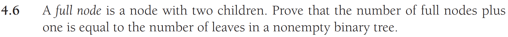
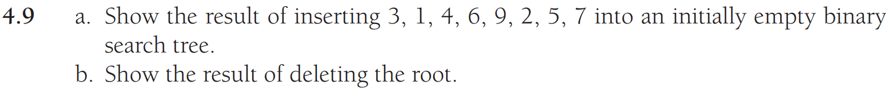
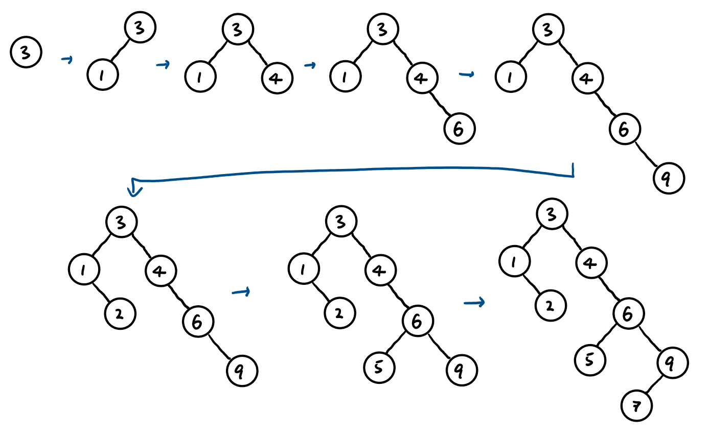
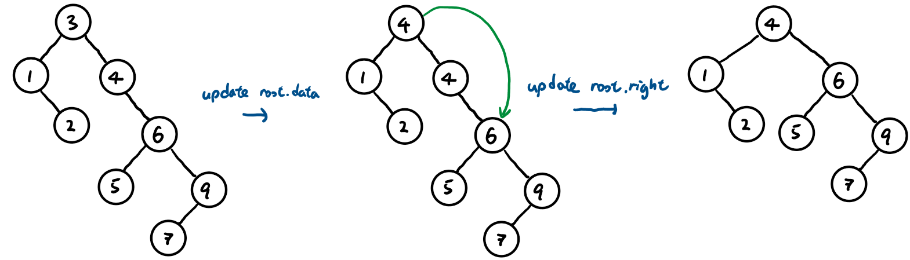
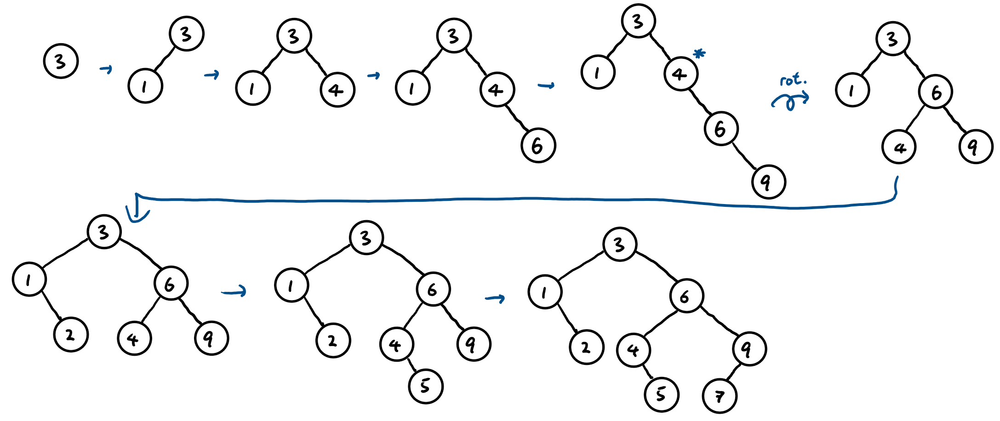
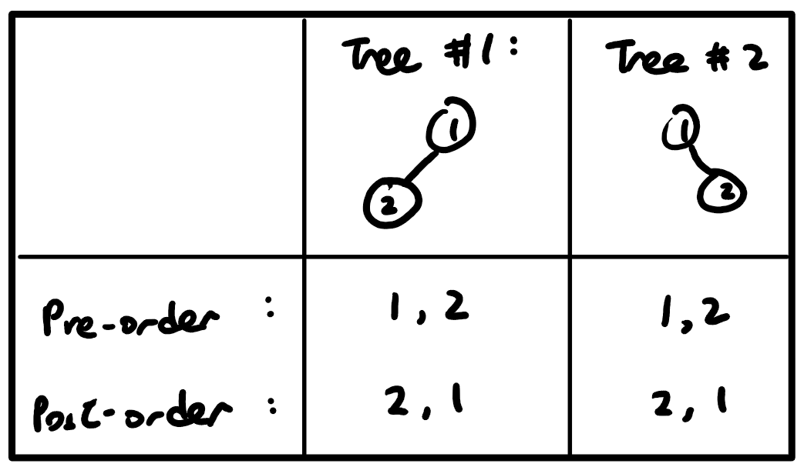
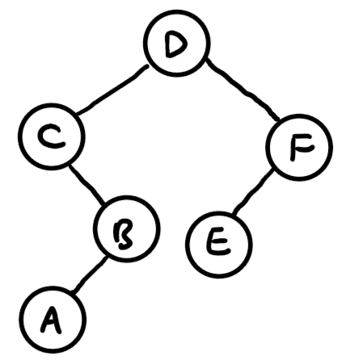
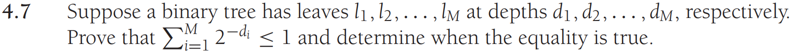
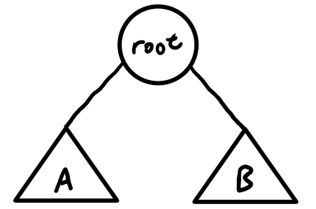

# Data Structures in Java - Homework 5

## Problem 1



__Answer:__

Let
$$
\begin{aligned}
N &= \text{number of total nodes},\\
F &= \text{number of full nodes},\\
L &= \text{number of leaf nodes},\\
S &= \text{number of nodes xwith a single child}.
\end{aligned}
$$


Where $N = F + L + S$

$$
\text{Total number of edges} = N-1
$$
$$
\begin{aligned}
\text{Number of edges for each:} \\
\text{Full node with children} &= 2 \\
\text{Single-child node with child} &= 1 \\
\text{Leaf node} &= 0
\end{aligned}
$$

$$
\begin{aligned}
\therefore \text{Total number of edges} = N-1 &= 2F + 1S + 0L \\
F + L + S - 1 &= 2F + S \\
\therefore L &= F + 1
\end{aligned}
$$

\newpage

## Problem 2



__a) Answer:__

{height=250}

__b) Answer:__

{height=120}


\newpage

## Problem 3
Show the same sequence of inserts as listed in the previous problem, except this time show the insertions into an AVL Tree. Make sure to show each rotation and each insert in a different tree.

__Answer:__ 




\newpage

## Problem 4
__(a)__ Assume that you are given both the preorder and postorder traversal of some binary tree t. Prove that this information, taken together, is not necessarily sufficient to reconstruct t uniquely, even if each value in t occurs only once.

__Answer:__

Proof by Counterexample

{height=140}

These two distinct trees have the same preorder and postorder traversals, therefore those two traversals alone is not nessarily sufficient to reconstruct `t` uniquely.

__(b)__ Now, assume that you have the preorder and inorder traversals of a tree (given below). Construct the corresponding binary tree and determine its postorder traversal.

*Inorder Traversal: C A B D E F*

*Preorder Traversal: D C B A F E*


__Answer:__

{height=120}


\newpage

## Problem 5



__Answer:__


Base cases:

__1)__ Height $h = -1$

The tree is empty (no nodes), so $M = 0$:

$$
\therefore \sum_{i=1}^{M} 2^{-d_i} = 0 \le 1
$$

__2)__ $h = 0$  

The tree only contains the root which is a leaf node.
, so $M = 1$, $d_1 = 0$:

$$
\therefore \sum_{i=1}^{M} 2^{-d_i} = 2^{-d_1} = 1 \le 1
$$

Assume that $\sum_{i=1}^{M} 2^{-d_i} \le 1$ is true for all trees of $h \le k$ for $k \ge 0$.

Consider the binary tree $t_1$ with $h = k+1$:

{height=120}

The subtrees $A$ and $B$ will have their heights $\le k$, so the assumption earlier works on subtrees $A$ and $B$.

Let $A$ have leaf nodes $a_1, a_2, a_3, ..., a_M$ at depths $p_1, p_2, p_3, ..., p_M$ relative to $A$; and $B$ have leaf nodes $b_1, b_2, b_3, ..., b_M$ at depths $q_1, q_2, q_3, ..., q_M$ relative to $B$ respectively.

Then $\sum_{i=1}^{M} 2^{-p_i} \le 1$ and $\sum_{i=1}^{M} 2^{-q_i} \le 1$ 

Relative to the root node in $t_1$, the new depths of the leaf nodes are $p_1 + 1, p_2 + 1, ..., p_M + 1$ and $q_1 + 1, q_2 + 1, ..., q_M + 1$ respectively.

$$
\begin{aligned}
\therefore \sum_{i=1}^{M} 2^{-d_i} &= \sum_{i=1}^{M} 2^{-(p_i+1)} + \sum_{i=1}^{M} 2^{-(q_i+1)} \\
\sum_{i=1}^{M} 2^{-d_i} &= \frac{1}{2} \sum_{i=1}^{M} 2^{-p_i} + \frac{1}{2} \sum_{i=1}^{M} 2^{-q_i} \\
\therefore \sum_{i=1}^{M} 2^{-d_i} &\le \frac{1}{2} (1 + 1) = 1\\
\end{aligned}
$$

If the condition is true for any binary tree of height $k \ge 0$, it is true for any binary tree of height $k+1$. Since it is true for height $h = -1$ and $0$, therefore it is true for all heights and so true for all binary trees by the principle of mathematical induction.

The equality $\sum_{i=1}^{M} 2^{-d_i} = 1$ is true if and only if the tree is full. Proof:

Base case: Height $h = 0$

The tree only contains the root which is a leaf node:

$$
\therefore \sum_{i=1}^{M} 2^{-d_i} = 2^{-d_1} = 1
$$

Assume that $\sum_{i=1}^{M} 2^{-d_i} = 1$ is true for all *full* binary trees of $h \le k$ for $k \ge 0$.

Consider a full binary tree $t_2$ of height $h = k+1$ with the same layout as $t_1$. Subtrees $A$ and $B$ are non-empty full binary trees of height $h \le k$ and so the assumption works for them.

By the same logic as the previous induction, $A$ and $B$ would have $\sum_{i=1}^{M} 2^{-p_i} = 1$ and $\sum_{i=1}^{M} 2^{-q_i} = 1$ respectively; and their depths would be $p_1 + 1, p_2 + 1, ..., p_M + 1$ and $q_1 + 1, q_2 + 1, ..., q_M + 1$ relative to the root node respectively. 

$$
\begin{aligned}
\therefore \sum_{i=1}^{M} 2^{-d_i} &= \sum_{i=1}^{M} 2^{-(p_i+1)} + \sum_{i=1}^{M} 2^{-(q_i+1)} \\
\sum_{i=1}^{M} 2^{-d_i} &= \frac{1}{2} \sum_{i=1}^{M} 2^{-p_i} + \frac{1}{2} \sum_{i=1}^{M} 2^{-q_i} \\
\therefore \sum_{i=1}^{M} 2^{-d_i} &= \frac{1}{2} (1 + 1) = 1
\end{aligned}
$$

If the condition is true for any binary tree of height $k \ge 0$, it is true for any binary tree of height $k+1$. Since it is true for height $h = 0$, therefore it is true for all heights and so true for all binary trees by the principle of mathematical induction.

\newpage

## Problem 6
Describe any modifications that you would need to make to the BinaryNode itself (for implementing lazy deletion), and then show the implementation for findMin.  You don't actually have to give us a full working class, only a description of the modification plus the findMin code.

__Answer:__

Add a `boolean isActive;` to BinaryNode, and initialize it to `false` in the constructor, so that we can just set currNode.isActive to false when we want currNode to be deleted. 

```java
public T findMin()
{
    if( root == null )
        throw new NullPointerException( );
    return findMin( root ).data;
}

private BinaryNode<T> findMin( BinaryNode<T> t )
{   
    if( t == null )
        return null;
    
    BinaryNode<T> leftMin = findMin( t.left );
    if ( leftMin != null )
        return leftMin;

    if ( t.isActive )
        return t;

    return findMin( t.right );
}
```