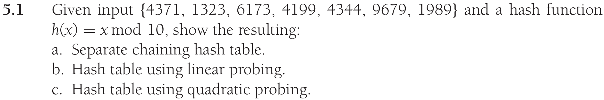
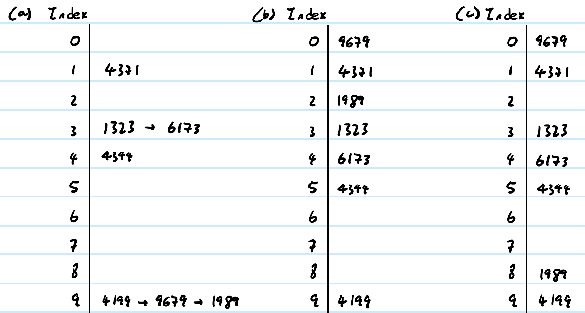
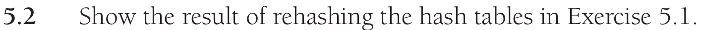
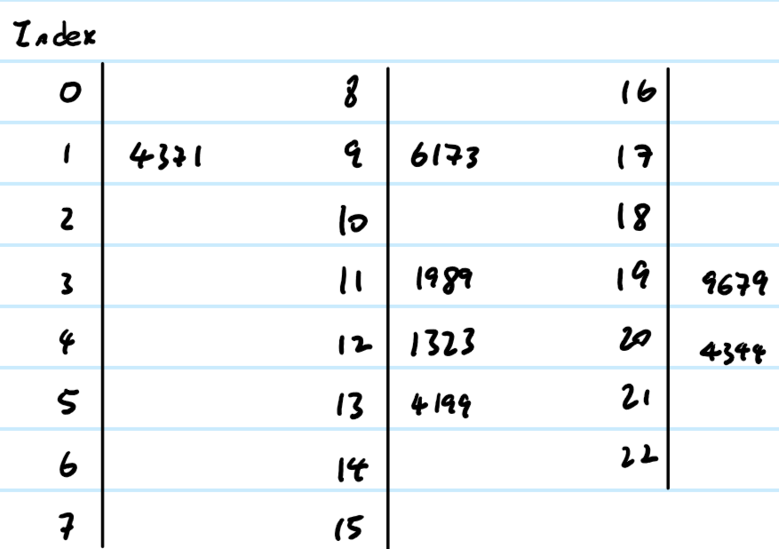
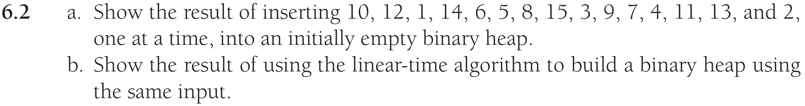
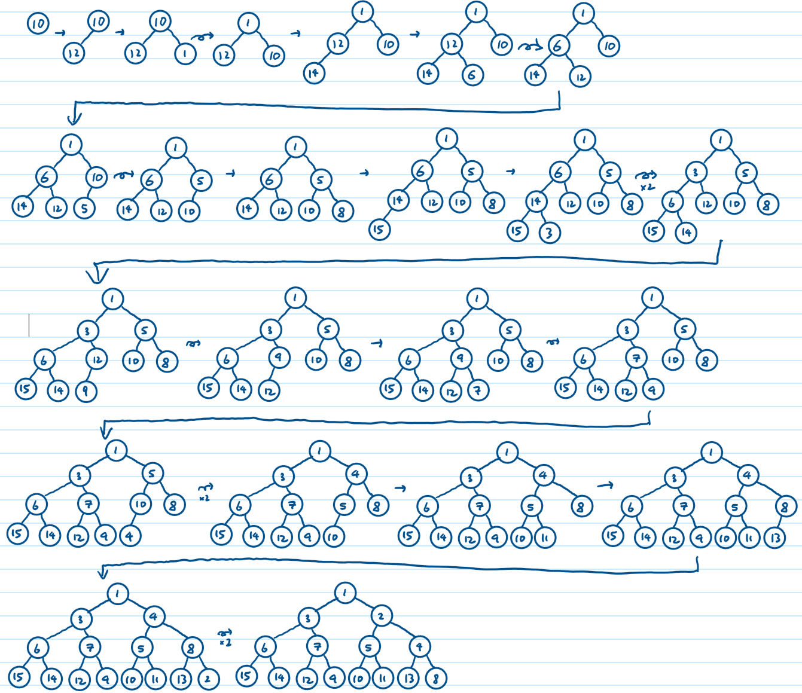
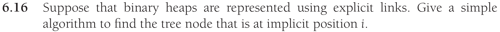
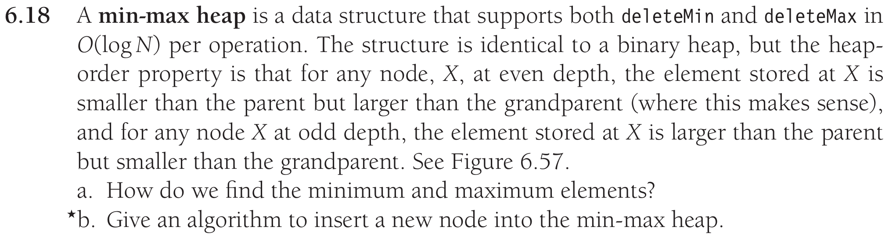
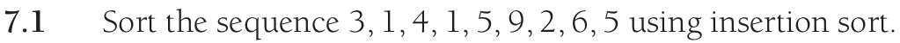

# Data Structures in Java - Homework 7

## Problem 1



__Answer:__

{height=200}

## Problem 2


__Use Table size of 23__

__Answer:__

Same for all (a), (b) and (c):

{height=200}

\newpage

## Problem 3



__a) Answer:__

{height=300}


__b) Answer:__

{height=250}

\newpage

## Problem 4



__Answer:__

Breadth-first traversal method and incrementing counter.

```java
public BinaryNode get(int i)
{
    if (root == null || i < 1) return null;

    ArrayList<BinaryNode> queue = new ArrayList<BinaryNode>();
    queue.add(root); // access to root through class

    int currPos = 0;

    while (!queue.isEmpty()) {
        currPos++;
        BinaryNode currNode = queue.remove(0);

        if (currPos == i) {
            return currNode;
        }

        if (currNode.left != null) {
            queue.add(currNode.left);
        }
        if (currNode.right != null) {
            queue.add(currNode.right);
        }
    }
    
    return null;
}
```

\newpage

## Problem 5



__a) Answer:__

Minimum is the root.
Maximum is the larger child of the root.

__b) Answer:__

Assuming heap is implemented in an array with extra space and the variable `size` is accessible through the class:

```java
public void insert(Comparable item) {
    heap[size+1] = item; // assuming there is extra space
    size++;
    
    int idx = size - 1;
    if (idx == 1) return;
    int parentIdx = idx/2;
    int depth = (int) (Math.log(idx) / Math.log(2));

    if (isEvenLevel(idx)) {
        if (item.compareTo(heap[parentIdx]) > 0) 
        { // if item (even) is larger than parent (odd)
            swap(idx, parentIdx); // swap them
            percolateUpEven(parentIdx); // percolate the item up through odd levels
        } else { // otherwise
            percolateUpOdd(idx); // percolate up through even levels
        }
    } else { // if item is at odd level
        if (item.compareTo(heap[parentIdx]) < 0) 
        { // if item (odd) is smaller than parent
            swap(idx, parentIdx); // swap them
            percolateUpEven(parentIdx); // percolate item up through even levels 
        } else { // otherwise
            percolateUpOdd(idx); // percolate up through odd levels
        }
    }
}

```


## Problem 6



```
Original: [3, 1, 4, 1, 5, 9, 2, 6, 5]
Swap 1: [1, 3 | 4, 1, 5, 9, 2, 6, 5]
Swap 2: [1, 3, 4 | 1, 5, 9, 2, 6, 5]
Swap 3: [1, 1, 3, 4 | 5, 9, 2, 6, 5]
Swap 4: [1, 1, 3, 4, 5 | 9, 2, 6, 5]
Swap 5: [1, 1, 3, 4, 5, 9 | 2, 6, 5]
Swap 6: [1, 1, 2, 3, 4, 5, 9 | 6, 5]
Swap 7: [1, 1, 2, 3, 4, 5, 6, 9 | 5]
Swap 8: [1, 1, 2, 3, 4, 5, 5, 6, 9]
```