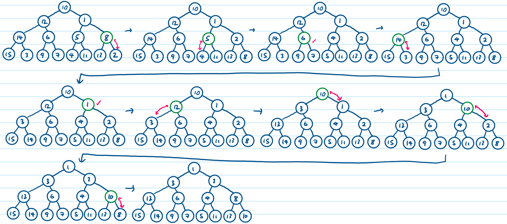

# Data Structures in Java - Homework 7

## Problem 1


__Answer:__

{height=200}

## Problem 2


__Use Table size of 23__

__Answer:__

Same for all (a), (b) and (c):

{height=200}

\newpage

## Problem 3


__a) Answer:__


__b) Answer:__

{height=30}

\newpage

## Problem 4


__Answer:__

Breadth-first traversal method and incrementing counter.

```java
public BinaryNode get(BinaryNode root, int i)
{
    if (root == null || i < 1) return null;

    ArrayList<BinaryNode> queue = new ArrayList<BinaryNode>();
    queue.add(root);

    int currPos = 0;

    while (!queue.isEmpty()) {
        currPos++;
        BinaryNode currNode = queue.remove(0);

        if (currPos == i) {
            return currNode;
        }

        if (currNode.left != null) {
            queue.add(currNode.left);
        }
        if (currNode.right != null) {
            queue.add(currNode.right);
        }
    }
    
    return null;
}
```

\newpage

## Problem 5


__a) Answer:__

Minimum is the root.
Maximum is the larger child of the root.

__b) Answer:__

- Insert at the next available left-most leaf position on the bottom level. 
- If its depth is even: 
    - While smaller than its grandparent, percolate up through only the even levels 
    - while larger than grandparents, percolate up through only odd levels 
- If its depth is odd, 
    - While larger than its grandparent, percolate up through only the odd levels
    - While smaller than grandparents, percolate up through only even levels


## Problem 6


```
Original: [3, 1, 4, 1, 5, 9, 2, 6, 5]
Swap 1: [1, 3 | 4, 1, 5, 9, 2, 6, 5]
Swap 2: [1, 3, 4 | 1, 5, 9, 2, 6, 5]
Swap 3: [1, 1, 3, 4 | 5, 9, 2, 6, 5]
Swap 4: [1, 1, 3, 4, 5 | 9, 2, 6, 5]
Swap 5: [1, 1, 3, 4, 5, 9 | 2, 6, 5]
Swap 6: [1, 1, 2, 3, 4, 5, 9 | 6, 5]
Swap 7: [1, 1, 2, 3, 4, 5, 6, 9 | 5]
Swap 8: [1, 1, 2, 3, 4, 5, 5, 6, 9]
```