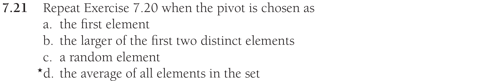
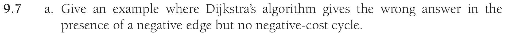
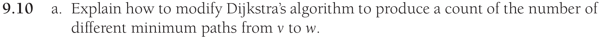
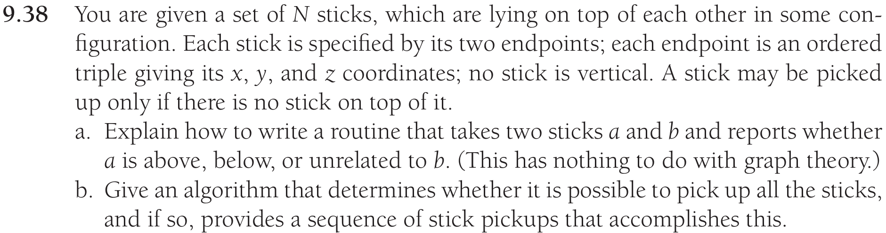

# Data Structures in Java - Homework 9

## Problem 1


__a) Answer:__ $O(Nlog(N))$

__b) Answer:__ $O(Nlog(N))$

__c) Answer:__ Worst case $O(N^2)$ with average $O(Nlog(N))$


## Problem 2



__a) Answer:__

Sorted input: $O(N^2)$

Reverse-ordered input: $O(N^2)$

Random input: Worst case $O(N^2)$ with average $O(Nlog(N))$

__b) Answer:__

Sorted input: $O(N^2)$

Reverse-ordered input: $O(N^2)$

Random input: Worst case $O(N^2)$ with average $O(Nlog(N))$

__c) Answer:__

Sorted input: Worst case $O(N^2)$ with average $O(Nlog(N))$

Reverse-ordered input: Worst case $O(N^2)$ with average $O(Nlog(N))$

Random input: Worst case $O(N^2)$ with average $O(Nlog(N))$

__d) Answer:__

Sorted input: Worst case $O(N^2)$ with average $O(Nlog(N))$ if uniformly distributed

Reverse-ordered input: Worst case $O(N^2)$ with average $O(Nlog(N))$ if uniformly distributed

Random input: Worst case $O(N^2)$ with average $O(Nlog(N))$ if uniformly distributed


\newpage

## Problem 3


```java
public class P3 {
    public static <T extends Comparable<? super T>> int[] threewayPartition(T[] theList, int start, int end) {

        if (start-end+1 > theList.length || start >= end) {
            return new int[]{start, start};
        }
    
        T pivot = theList[start];
    
        int i = start+1;
        int j = end;
        int leftEq = start;
        int rightEq = end+1;
        boolean iWaiting = false;
        boolean jWaiting = false;
    
        while (i <= j) {
    
            if (!iWaiting)
            {
                int iCmp = theList[i].compareTo(pivot);
    
                if (iCmp > 0) 
                {
                    iWaiting = true;
                } 
                else if (iCmp < 0) 
                {
                    i++;
                } 
                else // equal to pivot
                {
                    swap(theList, i++, ++leftEq);
                }
            }

            if (iWaiting && i>=j) { break; }
    
            if (!jWaiting && j > i)
            {
                int jCmp = theList[j].compareTo(pivot);
    
                if (jCmp < 0) 
                {
                    jWaiting = true;
                } 
                else if (jCmp > 0) 
                {
                    j--;
                } 
                else // equal to pivot
                {
                    swap(theList, j--, --rightEq);
                }
            }
    
            if (iWaiting && jWaiting) 
            {
                swap(theList, i++, j--);
                iWaiting = false;
                jWaiting = false;
            }

            System.out.printf("i %d j %d\n", i, j);
        }

        // Swapping Equals back into the middle
        j = i--;
    
        for (int a=start; a<=leftEq; a++) {
            swap(theList, a, i--);
        }
        leftEq = i+1;
    
        for (int b=end; b>=rightEq; b--) {
            swap(theList, b, j++);
        }
        rightEq = j-1;
    
        return new int[]{leftEq, rightEq};
    }
    
    public static <T extends Comparable<? super T>> void swap(T[] theList, int a, int b) {
        T tmp = theList[a];
        theList[a] = theList[b];
        theList[b] = tmp; 
    }
}
```

## Problem 4


__Answer:__ s, G, D, A, B, H, E, I, F, C, t


## Problem 5




## Problem 6




## Problem 7

