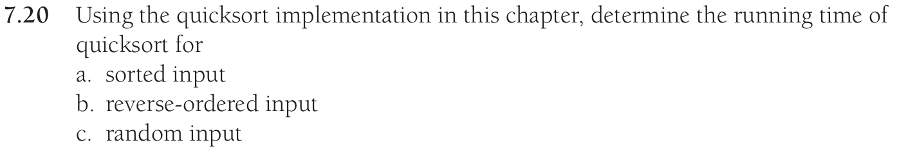
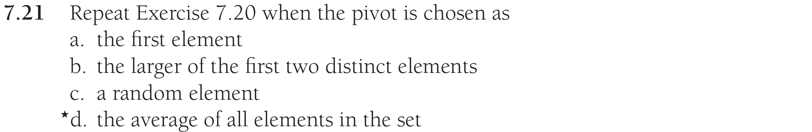
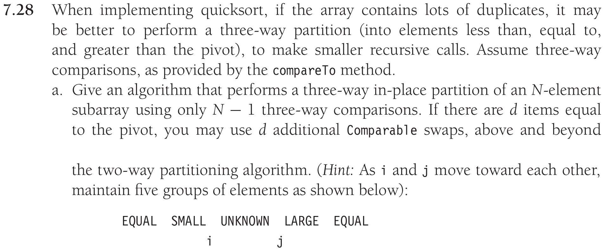
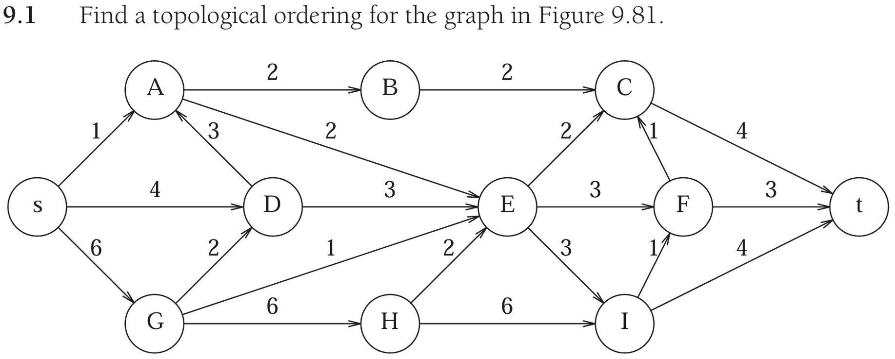
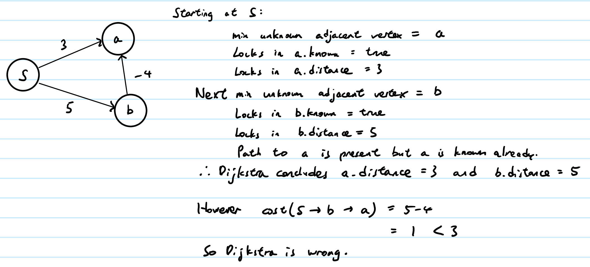
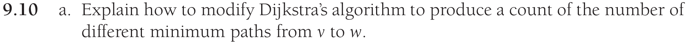
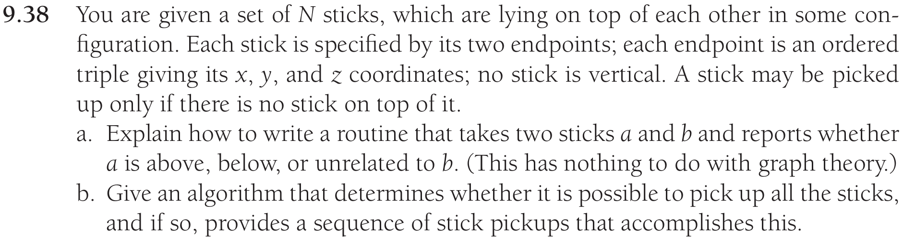

# Data Structures in Java - Homework 9

## Problem 1



__a) Answer:__ $O(Nlog(N))$

__b) Answer:__ $O(Nlog(N))$

__c) Answer:__ Worst case $O(N^2)$ with average $O(Nlog(N))$


## Problem 2



__a) Answer:__

Sorted input: $O(N^2)$

Reverse-ordered input: $O(N^2)$

Random input: Worst case $O(N^2)$ with average $O(Nlog(N))$

__b) Answer:__

Sorted input: $O(N^2)$

Reverse-ordered input: $O(N^2)$

Random input: Worst case $O(N^2)$ with average $O(Nlog(N))$

__c) Answer:__

Sorted input: Worst case $O(N^2)$ with average $O(Nlog(N))$

Reverse-ordered input: Worst case $O(N^2)$ with average $O(Nlog(N))$

Random input: Worst case $O(N^2)$ with average $O(Nlog(N))$

__d) Answer:__ (Averages only if uniformly distributed)

Sorted input: Worst case $O(N^2)$ with average $O(Nlog(N))$

Reverse-ordered input: Worst case $O(N^2)$ with average $O(Nlog(N))$

Random input: Worst case $O(N^2)$ with average $O(Nlog(N))$


\newpage

## Problem 3



```java
public class P3 {
    public static <T extends Comparable<? super T>> 
        int[] threewayPartition(T[] theList, int start, int end) {

        if (start-end+1 > theList.length || start >= end) {
            return new int[]{start, start};
        }
    
        T pivot = theList[start];
    
        int i = start+1;
        int j = end;
        int leftEq = start;
        int rightEq = end+1;
        boolean iWaiting = false;
        boolean jWaiting = false;
    
        while (i <= j) {
            if (!iWaiting)
            {
                int iCmp = theList[i].compareTo(pivot);
    
                if (iCmp > 0) {
                    iWaiting = true;
                } 
                else if (iCmp < 0) {
                    i++;
                } 
                else { // equal to pivot
                    swap(theList, i++, ++leftEq);
                }
            }

            if (iWaiting && i >= j) { break; }
    
            if (!jWaiting && j > i)
            {
                int jCmp = theList[j].compareTo(pivot);
    
                if (jCmp < 0) {
                    jWaiting = true;
                } 
                else if (jCmp > 0) {
                    j--;
                } 
                else { // equal to pivot
                    swap(theList, j--, --rightEq);
                }
            }
    
            if (iWaiting && jWaiting) {
                swap(theList, i++, j--);
                iWaiting = false;
                jWaiting = false;
            }
        }

        // Swapping Equals back into the middle
        j = i--;
    
        for (int a=start; a<=leftEq; a++) {
            swap(theList, a, i--);
        }
    
        for (int b=end; b>=rightEq; b--) {
            swap(theList, b, j++);
        }
    
        return new int[]{i+1, j-1};
    }
    
    public static <T extends Comparable<? super T>> 
        void swap(T[] theList, int a, int b) {
        T tmp = theList[a];
        theList[a] = theList[b];
        theList[b] = tmp; 
    }
}
```

## Problem 4



__Answer:__ s, G, D, A, B, H, E, I, F, C, t


## Problem 5


__Answer:__




\newpage

## Problem 6



Implement Dijkstra with an extra int counter as an attribute of each Vertex, representing the number of paths that can get to that vertex with that (temporary) cost/distance.

Initialize counter = 0 for all vertices.

Set starting vertex v.counter = 1. 

When going through each adjacent vertex B of a vertex A:
```java
if ( A.cost + cost(from A to B) < B.cost ) {
    B.counter = A.counter; 
    B.cost = A.cost + cost(from A to B);
}
else if ( A.cost + cost(from A to B) == B.cost ) {
    B.counter += A.counter;
}
```

## Problem 7



__a) Answer:__

Find the intersection of sticks a and b in the x-y plane. If there is no x-y plane intersection, a and b are unrelated.

Find the z-coordinates of both a and b at that intersection (x, y). Whichever stick's z-coordinate is larger here indicates that it is on top of the other. 

__b) Answer:__

Model the stack of sticks as a directed graph, where each vertex is a stick and each edge is when the sticks (represented by the edge's vertices) overlap directed from the upper stick to lower stick.

If the resulting graph is cyclic, then it is not possible to pick up all the sticks. Otherwise it is possible, then topologically sort the graph to get a topological ordering for the sequence that accomplishes it.
